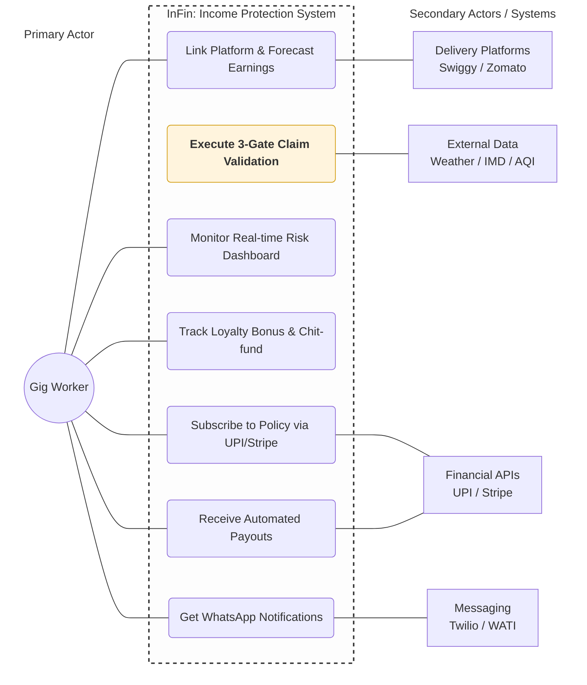

# InFin - Income Protection for India's Gig Workers

## Abstract
InFin is a parametric, AI-driven income insurance system designed for gig economy workers. It leverages real-time external data sources and behavioral analytics to detect disruption events and autonomously process claims without user intervention.

The system employs a multi-stage validation pipeline consisting of a Disruption Validity Score (DVS), Zone Peer Comparison Score (ZPCS), and an Activation Eligibility Check (AEC) to ensure accurate and fraud-resistant claim verification. Personalized premiums (in the form of Chit-funds) are dynamically computed based on user earnings and regional risk probabilities. 
We integrate automated event detection, data-driven validation, and instant digital payouts via UPI, InFin delivers a scalable and efficient alternative to traditional insurance models for high-volatility income environments.

---

## Table of Contents

- [Overview](#overview)
- [Problem](#problem)
- [How It Works](#how-it-works)
  - [Engine 1 — Policy Pay](#engine-1--policy-pay)
  - [Engine 2 — Policy Claim](#engine-2--policy-claim)
- [3-Gate Claim Validation](#3-gate-claim-validation)
- [Smart Payout Logic](#smart-payout-logic)
- [Anti-Gaming Rules](#anti-gaming-rules)
- [Loyalty Bonus — Chit Fund Model](#loyalty-bonus--chit-fund-model)
- [End-to-End Claim Flow](#end-to-end-claim-flow)
- [Database Schema](#database-schema)
- [Tech Stack](#tech-stack)
- [Product Screens](#product-screens)
- [Getting Started](#getting-started)
- [Anti-Spoofing & Fraud Detection Architecture](#Anti-Spoofing-&-Fraud-Detection-Architecture)

---


## Problem

| Pain Point | Reality |
|---|---|
| **Who it's for** | Swiggy / Zomato delivery partners in Indian cities |
| **Daily earnings** | ₹700 – ₹1,100/day |
| **Risk** | Income drops to zero during floods, bandhs, heatwaves and riots |
| **Why existing insurance fails** | Expensive, tiered, one-size-fits-all, requires paperwork the worker can't afford to do |

---

## How It Works

## Engine 1:- Policy Pay - Expected Earnings Forecast (ML-Based)

Each worker's weekly premium is computed individually from their verified platform earnings and their zone's historical disruption rate. Instead of using a simple average, we predict each worker’s expected daily earnings using a time-series forecasting model.

Gig worker income is highly variable:
- Weekends have higher demand
- Weather disruptions reduce earnings
- Seasonal patterns affect delivery volume
Therefore, using a static average would lead to inaccurate pricing and payouts.

### Model Approach
We use a time-series model (Exponential Smoothing) trained on:

- Last 4 weeks of earnings history
- Day-of-week patterns (weekday vs weekend)
- Delivery volume trends
- Seasonal effects (monsoon, festivals)

**Output**: expected_daily_earnings = ML predicted value for next day

**Data Window**: We use a rolling 4-week window as it provides the best balance between recency (captures current behavior) & stability (reduces noise)

## Data Pipeline

1. Earnings data is collected per worker and stored in `earnings_history`
2. A weekly job trains the forecasting model per worker
3. Engine 1 uses this predicted value to compute weekly premium

```
weekly_premium = ROUND(
  expected_daily_earnings
  × disruption_probability
  × conflict_ratio
  × 1.15 / 0.65
)
```
```
conflict_ratio = (workers paid in past 4 weeks) / (workers who claimed) 
```

### Example
— Rajan, Chennai
- Daily earnings: ₹872
- Disruption probability: 0.0615
- Conflict ratio: 0.70

```
= ROUND(872 × 0.0615 × 0.70 × 1.15 / 0.65)
= ₹58 / week
```

---

## Engine 2:- Policy Claim - 3-Gate Claim Validation

### Gate 1 — Disruption Validity Score (DVS)

*Question: Did a real external disruption actually occur?*

This gate evaluates only **external data sources** (weather APIs, AQI APIs, IMD alerts).  
No worker data is considered at this stage.


### DVS Formula

DVS is computed as a weighted combination of:

DVS = (source_agreement_score × 0.60)  
   + (threshold_breach_score × 0.40)

### Source Agreement Score (60%)

Measures how many independent data sources confirm the disruption.

| Sources Confirming | Score |
|------------------|------|
| Both sources confirm | 1.00 |
| Only one source confirms | 0.50 |
| Neither confirms | 0.00 |
| Single-source trigger (e.g., AQI via CPCB) | 1.00 if API confirms |

 Rationale: Multiple independent confirmations increase confidence that the event is real.


### Threshold Breach Score (40%)

Measures how strongly the observed value exceeds the predefined threshold.

Each disruption type has a threshold stored in the system:

- Rain ≥ 35 mm → disruption
- AQI ≥ 300 → hazardous
- Heat Index ≥ 42°C → extreme

### Formula
```
threshold_breach_score =  
min(1.00, ((actual_value − threshold_value) / threshold_value) × 2)
```

### Example Calculations

| Trigger | Threshold | Actual | Breach Score | Interpretation |
|--------|----------|--------|--------------|---------------|
| Rainfall | 35 mm | 37 mm | 0.114 | Borderline |
| Rainfall | 35 mm | 52 mm | 0.971 | Strong disruption |
| Rainfall | 35 mm | 80 mm | 1.00 | Extreme event |

 Small breaches → low confidence  
 Large breaches → high confidence  


### Final Decision

**Pass condition:**

DVS ≥ 0.70 → Valid disruption  
DVS < 0.70 → Rejected (event considered weak or unconfirmed)

---

### Gate 2 — Zone Peer Comparison Score (ZPCS)

Compares the claimant's delivery activity against all peers in the same pincode during the same window. If the disruption was real, most workers in the zone will show reduced activity.

**Pass condition:** ≥ 35% of zone peers are affected (≥ 40% drop in their deliveries)

---

### Gate 3 — Activation Eligibility Check (AEC)

A hard boolean check covering:
- Was the policy bought **before** the event was publicly announced?
- Is the worker outside the 6-hour refractory window for spontaneous events?
- Is the event outside the 72-hour known-event exclusion window?

**Pass condition:** AEC = TRUE

---

No action required from the worker. The system runs daily and checks for disruptions automatically.

```
Gate 1 → DVS ≥ 0.70   (Was the disruption real?)
Gate 2 → ZPCS ≥ 0.35  (Was it zone-wide?)
Gate 3 → AEC = TRUE   (Was the event covered?)

All 3 pass → payout formula runs → UPI transfer
```

Payout is triggered and released only once the disruption parameter that caused Gate 1 to pass returns to normal (back below threshold) and the insurance ends.

---


## Smart Payout Logic

Payout is not all-or-nothing. It compensates for what the worker **would have earned** minus what they **actually earned**, floored at 50% of their disrupted expected income.

**Weekly cap = 3× daily average earnings**

| Scenario | Payout |
|---|---|
| Worker didn't work | Floor amount (50% of disrupted expected income) |
| Worked but earned below floor | `floor − actual_earned` (tops up to floor) + (0.1*floor) |
| Worked and earned above floor | ₹0 (already protected) |

**Example:**
- Expected: ₹800, 6-hour event → disrupted expected = ₹700, floor = ₹350
- If worker earned ₹100 → payout = ₹ 250+35 (350*0.1) (total income = ₹285) [worker earns: 385]

---

## Anti-Gaming Rules

| Event Type | Exclusion Rule |
|---|---|
| **Bandh / Strike** | Policy bought after public announcement of the bandh date is excluded for that event |
| **Cyclone** | Policy bought after IMD orange alert issuance is excluded for that cyclone |
| **Flood** | ML model predicts affected zones and days; policies bought after flood risk is confirmed are excluded for those specific dates and pincodes |
| **Spontaneous events** (riots, road closures, Section 144) | 6-hour refractory period — must be a policyholder at least 6 hours before the event started |
| **Known-event window** | If the disruption was already in the alert snapshot at subscription time and current time is within 72 hours of subscription, the claim is excluded |

---

## Loyalty Bonus — Chit Fund Model

Workers who pay continuously for 24 weeks (6 months) never truly "lose" their premiums.

| Scenario | Premium Return |
|---|---|
| No claims filed during full term | **80–90%** returned |
| Claims made during term | **30–40%** returned, scaled by claim frequency |

**Loyalty counter reset rules:**
- If a worker misses a weekly payment OR claims a payout during the term, the cumulative premium sum and transaction count reset to zero.
- Only an unbroken 24-week streak qualifies for the end-of-term settlement.

Settlement is triggered automatically upon plan completion and paid via UPI.

---

## End-to-End Claim Flow

```
External API detects disruption
        ↓
Gate 1: DVS computed
        ↓ (pass)
Gate 2: ZPCS computed
        ↓ (pass)
Gate 3: AEC verified
        ↓ (pass)
Disruption parameter returns to normal
        ↓
Payout calculated
        ↓
UPI transfer to worker
        ↓
WhatsApp notification sent
```

All steps are fully automated. Workers are notified via WhatsApp at each stage.

---

## Database Schema

Built on **Supabase (Postgres)**.

### `workers`
| Column | Type | Notes |
|---|---|---|
| `id` | uuid (PK) | |
| `phone` | text | |
| `platform` | text | Swiggy / Zomato |
| `city` | text | |
| `pincode` | text | Zone key |
| `expected_daily_earnings` | numeric | Updated per order in real time |
| `disruption_probability` | numeric | Updated per disrupted day over rolling 1-year window |

### `policies`
| Column | Type | Notes |
|---|---|---|
| `id` | uuid (PK) | |
| `worker_id` | uuid (FK → workers) | |
| `weekly_premium` | numeric | |
| `status` | text | active / expired / cancelled |
| `plan_duration_months` | int | 3 or 6 |
| `subscribed_at` | timestamptz | |
| `next_due_date` | timestamptz | |

### `zone_disruption_events`
| Column | Type | Notes |
|---|---|---|
| `id` | uuid (PK) | |
| `pincode` | text | |
| `event_type` | text | flood / cyclone / bandh / heat / aqi |
| `actual_value` | numeric | |
| `threshold_value` | numeric | |
| `dvs_score` | numeric | |
| `dvs_passed` | boolean | |
| `is_announced` | boolean | |
| `is_spontaneous` | boolean | |

### `peer_activity_snapshots`
| Column | Type | Notes |
|---|---|---|
| `event_id` | uuid (FK) | |
| `worker_id` | uuid (FK) | |
| `deliveries_during_trigger` | int | |
| `avg_deliveries_same_window` | numeric | |
| `activity_reduction` | numeric | % drop |
| `is_affected` | boolean | ≥ 40% drop |

### `claims`
| Column | Type | Notes |
|---|---|---|
| `policy_id` | uuid (FK) | |
| `event_id` | uuid (FK) | |
| `dvs_passed` | boolean | |
| `zpcs_passed` | boolean | |
| `aec_passed` | boolean | |
| `floor_amount` | numeric | |
| `actual_earned` | numeric | |
| `final_payout` | numeric | |
| `weekly_cap_remaining` | numeric | |
| `status` | text | pending / approved / paid |
| `paid_at` | timestamptz | |

### `loyalty_settlements`
| Column | Type | Notes |
|---|---|---|
| `policy_id` | uuid (FK) | |
| `total_premiums_paid` | numeric | |
| `had_claims` | boolean | |
| `return_percentage` | numeric | |
| `return_amount` | numeric | |
| `settled_at` | timestamptz | |

---

## Tech Stack

| Layer | Technology |
|---|---|
| **Frontend** | Next.js (App Router) |
| **Database** | Supabase (Postgres + Auth + Realtime) |
| **Backend logic** | Supabase Edge Functions |
| **UI** | Tailwind CSS + shadcn/ui |
| **Payments** | Stripe (premium collection), UPI (payouts) |
| **Notifications** | WhatsApp via Twilio / WATI |
| **Weather & AQI** | External weather and AQI APIs |
| **Flood prediction** | Custom ML model (zone + date level) |
| **Disaster alerts** | IMD Alert APIs |

---

## Product Screens

### Worker Dashboard
Active policy card, weekly cap remaining, live zone disruption alert banner (Supabase Realtime), and recent claims feed showing gate-by-gate pass/fail results.

### Claim Detail Modal
DVS gauge breakdown, ZPCS peer count visualization, AEC pass/fail with plain-language reason, step-by-step payout math.

### Policy Subscription (3 steps)
1. Phone OTP verification
2. Platform account link + earnings fetch
3. Plan selection (3 or 6 months) with loyalty return preview → UPI payment confirm

### Loyalty Tracker
Progress bar, total premiums paid, live return projection for zero-claim vs claim scenarios, countdown to settlement date.

### Admin / Ops Panel
All disruption events with gate scores, claims pipeline (pending → approved → paid), zone heatmap by pincode, manual override with audit log.

---

## Getting Started

```bash
# Clone the repo
git clone https://github.com/your-org/infin.git
cd infin
```

```bash
# Install dependencies
npm install
```

```bash
# Set up environment variables
cp .env.example .env.local
# Fill in: NEXT_PUBLIC_SUPABASE_URL, SUPABASE_SERVICE_ROLE_KEY,
#          STRIPE_SECRET_KEY, TWILIO_ACCOUNT_SID, TWILIO_AUTH_TOKEN

# Run database migrations
npx supabase db push
```

```bash
# Start development server
npm run dev
```

---



## Anti-Spoofing & Fraud Detection Architecture

### Problem & Our Approach:

GPS spoofing breaks systems that rely on a single signal. So instead of trusting location alone, we propose a multi-signal verification layer that generates a Worker Authenticity Score (WAS) using five independent signals - mobility patterns, peer comparison, network behavior, device integrity and platform activity.

For example, a real worker shows gradual movement, unstable network and reduced deliveries; while a spoofed user shows teleportation, stable WiFi and no activity.

Based on this score, we don’t just approve or reject, we introduce a ‘flagged’ state where suspicious claims are delayed but not denied, thereby protecting honest workers. So even if GPS is compromised, the system stays secure because behavior is much harder to fake than location

---

To calculate **Worker Authenticity Score (WAS)** using multiple independent signals:

```bash
WAS = f(
  mobility_pattern,
  peer_consistency,
  network_behavior,
  platform_activity
)
```

Even if one signal is manipulated, the system remains reliable because decisions are based on combined behavioral evidence.

---

### System Flow

1. External APIs detect disruption  
2. Gate 1 (DVS) validates event authenticity  
3. Multi-signal verification layer evaluates worker behavior  
4. Worker Authenticity Score (WAS) is computed  
5. Decision engine classifies the claim  
6. Payout or audit is triggered  

---

### Core Detection Layers

#### Mobility Trace Engine
- Tracks continuous GPS path instead of static location  
- Checks speed consistency and road alignment  
- Detects teleportation and unrealistic movement

#### Peer Consistency
- Compares worker behavior with others in the same zone  
- Detects coordinated patterns across multiple accounts  
- Identifies fraud clusters 

#### Network Behaviour
- Analyzes cell tower switching patterns  
- Measures signal strength fluctuations  
- Detects stable WiFi usage during disruption    

#### Platform Activity Engine
- Monitors delivery activity before disruption  
- Checks order acceptance and completion patterns  
- Detects unnatural inactivity  

---

### Worker Authenticity Score (WAS)

Each signal contributes to a final trust score.

**Example weighting:**- Mobility: 25%, Network: 20%, Device Integrity: 20%, Platform Activity: 20%, Peer Consistency: 15%  

### Decision System

Instead of binary approval, we use three outcomes:

#### 🟢 Approved
- High authenticity score  
- Instant payout  

#### 🟡 Flagged
- Suspicious but not confirmed  
- Payout delayed, not denied  
- Additional verification triggered  

#### 🔴 Blocked
- Strong fraud indicators  
- Claim rejected and sent for audit  

---

### User Experience Protection

Flagged claims are not rejected immediately.

The system:
- Delays payout instead of denying it  
- Re-evaluates after more data is available  
- Releases payment if the worker is verified  

This ensures genuine workers are not penalized due to temporary network or sensor issues.

---

### Why This Works

Fraudsters can fake GPS location.

But they cannot easily fake:
- Real movement patterns  
- Network instability  
- Device-level signals  
- Delivery behavior  
- Peer activity consistency  

---

### Key Insight

> InFin does not trust location.  
> It trusts behavior across multiple independent systems.
