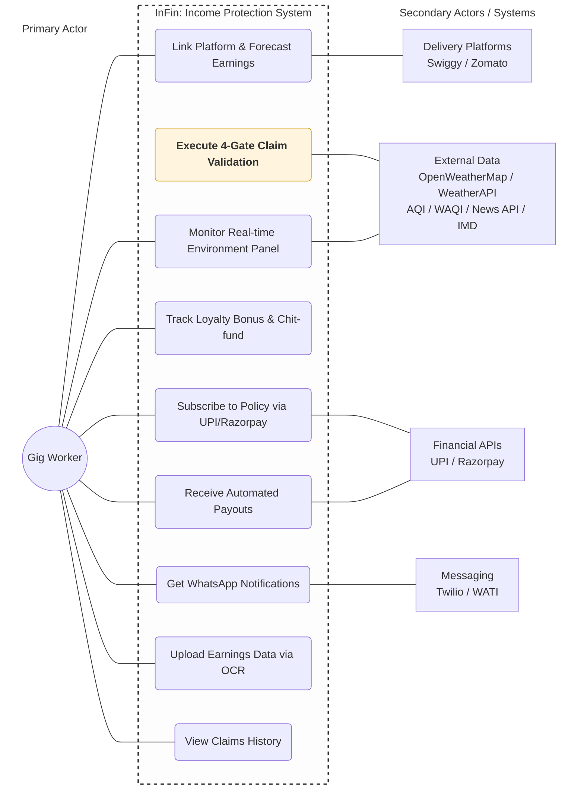

# InFin — Income Protection for India's Gig Workers

> **Parametric income insurance for Swiggy & Zomato delivery partners.**
> Automated payouts. Zero paperwork. No manual claims.

---

## 🚀 Phase 3 — Soar: What's New

> *"This phase was all about one thing — making sure that every decision our system makes is backed by real data, not assumptions."*

After Phase 2 feedback, the jury's key suggestion was clear: **move away from synthetic data and integrate real-world signals**. Phase 3 is our answer to that.

### Real-World API Integration

After the feedback we received in the previous phase, one of the key suggestions from the jury was to move away from synthetic data and integrate real-world signals into the system. So in Phase 3, we focused on making InFin more realistic, more reliable, and closer to an actual deployable product.

| API | Purpose |
|---|---|
| **OpenWeatherMap + WeatherAPI + Open-Meteo** | Live temperature, weather conditions, and rainfall data for DVS Gate 1 |
| **AQI API + WAQI API** | Real-time air quality index — replaces all synthetic AQI inputs |
| **News API** | Live disruption detection — strikes, bandhs, Section 144, riots in the worker's area |

Instead of relying on simulated inputs, the system now continuously fetches live environmental and situational data. Every gate decision is backed by real signals.

### Four Redesigned Product Panels

The application has been restructured into four focused panels:

#### 1. Overview (Major Redesign)
The overview page now features a **complete Policy Dashboard**:
- Weekly premium display with sigmoid-computed amount
- Policy active status and coverage window
- Weeks consistently paid (directly tied to loyalty model progress)
- Visual breakdown of how the 4-gate validation system works — in plain language
- InFin customer care contact details for full transparency

#### 2. Environment (New — Real-Time Intelligence)
Live zone telemetry and signals, all fetched from real APIs in real time:
- **Current temperature and weather conditions** (OpenWeatherMap / WeatherAPI)
- **Live AQI index** for the worker's zone (AQI / WAQI API)
- **News-based disruption detection** — the right panel shows live reports of strikes, bandhs, or unusual events happening in the worker's specific area (News API)
- **Live Ward Coverage Map** — dynamically renders the exact ward being monitored and covered by InFin

#### 3. Claims History (New)
Full transparency on all past claim activity:
- Number of times the worker has claimed
- Whether each claim was approved or rejected
- Gate-by-gate result for each event
- Helps workers understand exactly how decisions are made over time — builds trust in the automated system

#### 4. Earnings Upload (New — Replacing Synthetic Data)
Since gig platform APIs are not publicly accessible, workers can now upload their earnings data directly from the app:
- Upload earnings summaries (screenshots or PDFs) from Swiggy / Zomato partner apps
- Processed via OCR and stored securely
- Used to compute accurate premiums and payouts from real worker data
- Eliminates the bias that synthetic data introduced into ML model training

### Phase 3 Summary

| What changed | Why |
|---|---|
| Three weather APIs integrated | Jury feedback — eliminate synthetic weather data |
| AQI and WAQI APIs integrated | Real-time air quality instead of mock values |
| News API integrated | Detect real-world civic disruptions (bandhs, strikes) |
| Overview page rebuilt | Policy dashboard, gate explainer, customer care — more transparency |
| Environment panel added | Live telemetry, AQI, disruption news, ward map — all real-time |
| Claims history panel added | Full audit trail visible to worker — builds trust |
| Earnings upload panel added | Worker-submitted real data replaces synthetic earnings assumptions |

> Phase 3 moved InFin from a conceptual system to a much more realistic, data-driven platform. By integrating real-time APIs, improving transparency through the dashboard, and enabling real user data input, InFin is now more accurate, more trustworthy, and much closer to real-world deployment.

## Pitch Deck

📊 **[Pitch Deck InFin](https://drive.google.com/file/d/1fJ0UqVgZmNLUnud5WSNEyr9X4IaTbd_T/view?usp=drive_link)**
📊 **[Deployment](https://infin-tau.vercel.app/)**


---

## Table of Contents

- [Abstract](#abstract)
- [Problem](#problem)
- [How It Works](#how-it-works)
- [Engine 1 — Policy Pay (Premium Calculation)](#engine-1--policy-pay)
- [Engine 2 — Policy Claim (4-Gate Validation)](#engine-2--policy-claim)
  - [Gate 1 — Disruption Validity Score (DVS)](#gate-1--disruption-validity-score-dvs)
  - [Gate 2 — Zone Peer Comparison Score (ZPCS)](#gate-2--zone-peer-comparison-score-zpcs)
  - [Gate 3 — Activation Eligibility Check (AEC)](#gate-3--activation-eligibility-check-aec)
  - [Gate 4 — Worker Authenticity Score (WAS)](#gate-4--worker-authenticity-score-was)
- [Ward Affinity System](#ward-affinity-system)
- [Smart Payout Logic](#smart-payout-logic)
- [Anti-Gaming Rules](#anti-gaming-rules)
- [Loyalty Bonus — Chit Fund Model](#loyalty-bonus--chit-fund-model)
- [Data Integration Strategy](#data-integration-strategy)
- [Risk Pool Model](#risk-pool-model)
- [Edge Cases & System Failures](#edge-cases--system-failures)
- [Unit Economics](#unit-economics-pilot-estimates)
- [Security Architecture](#security-architecture)
- [End-to-End Claim Flow](#end-to-end-claim-flow)
- [Policy Document](#policy-document)
- [Database Schema](#database-schema)
- [Tech Stack](#tech-stack)
- [Product Screens](#product-screens)
- [Getting Started](#getting-started)

---

## Abstract

InFin is a parametric income protection ecosystem designed for India's gig economy, providing an automated safety net for delivery partners against hyper-local disruptions like floods, heatwaves, and strikes. To ensure long-term sustainability and worker trust, InFin operates on a **Hybrid Insurance-Chit Fund Model**: workers who maintain a 24-week claim-free streak recover up to most of their premiums, turning protection into a low-risk savings habit.

The system is powered by two proprietary engines:

**Engine 1 (Policy Pay):** Uses a time-series ML model to forecast earnings, applying a Sigmoid-scaled premium formula that dynamically adjusts risk while strictly capping weekly costs at ₹100 to ensure affordability for low-income earners.

**Engine 2 (Policy Claim):** A 4-Gate validation pipeline that has evolved from broad city-level monitoring to hyper-local Ward-Based Analysis — now powered entirely by real-time API data.

### Core Innovations

- **Real-Time API Stack (Phase 3):** Weather data from OpenWeatherMap, WeatherAPI, and Open-Meteo. AQI from AQI and WAQI APIs. Civic disruption detection via News API. No synthetic data in production.

- **Ward Affinity & Compensation Logic:** The system identifies a worker's "Prime Ward" through historical data. If a disruption occurs, InFin calculates if the worker could have reasonably compensated for lost earnings by moving to an adjacent, unaffected "Best Ward." Payouts are triggered only when regional disruption makes such compensation impossible.

- **Gate 4: Anti-Spoofing via Cell Tower Triangulation:** To combat GPS spoofing, InFin introduces a hardware-level validation layer. The system pulls Cell Tower IDs and signal strength via the Android API, performs an OpenCellID lookup, and cross-checks this physical network location against the user's claimed Ward coordinates.

- **Earnings Upload via OCR (Phase 3):** Workers upload actual earnings data from platform apps. OCR processing replaces synthetic earnings assumptions with real worker data, reducing ML model bias.

- **Smart Payouts & Anti-Gaming:** Includes a Smart Payout Logic that guarantees an income floor and Anti-Gaming Rules (e.g., 6-hour refractory periods) to prevent on-demand policy purchases during active disasters.


---

## Problem

| Pain Point | Reality |
|---|---|
| **Who it's for** | Swiggy / Zomato delivery partners in Indian cities |
| **Daily earnings** | ₹700 – ₹1,100/day |
| **Risk** | Income drops to zero during floods, bandhs, heatwaves, and riots |
| **Why existing insurance fails** | Expensive, tiered, one-size-fits-all, requires paperwork the worker can't afford to do |

---

## How It Works

```
┌─────────────────────────────────────────────────────────────┐
│                        INFIN SYSTEM                         │
│                                                             │
│  ┌──────────────┐              ┌────────────────────────┐   │
│  │  ENGINE 1    │              │       ENGINE 2         │   │
│  │  Policy Pay  │              │     Policy Claim       │   │
│  │              │              │                        │   │
│  │  ML Earnings │              │  Gate 1 → DVS          │   │
│  │  Forecast    │              │  Gate 2 → ZPCS         │   │
│  │      ↓       │              │  Gate 3 → AEC          │   │
│  │  Sigmoid     │              │  Gate 4 → WAS          │   │
│  │  Premium     │              │      ↓                 │   │
│  │  Calc (≤₹100)│              │  Smart Payout          │   │
│  │      ↓       │              │  via UPI               │   │
│  │  Weekly UPI  │              │                        │   │
│  │  Debit       │              │                        │   │
│  └──────────────┘              └────────────────────────┘   │
└─────────────────────────────────────────────────────────────┘
```

---

## Engine 1 — Policy Pay

### Expected Earnings Forecast (ML-Based)

Each worker's weekly premium is computed individually from their verified platform earnings and their zone's historical disruption rate. Instead of a static average, InFin predicts each worker's expected daily earnings using a **time-series forecasting model**.

Gig worker income is highly variable:
- Weekends have higher demand
- Weather disruptions reduce earnings
- Seasonal patterns affect delivery volume (monsoon, festivals)

### Model Approach

We use **Exponential Smoothing** trained on a rolling 4-week window:

| Input Signal | Purpose |
|---|---|
| Last 4 weeks of earnings history | Captures recent behaviour |
| Day-of-week patterns | Weekday vs weekend correction |
| Delivery volume trends | Platform-level demand signals |
| Seasonal effects | Monsoon, festival adjustments |

**Output:** `expected_daily_earnings` — ML-predicted value for the next day.

> **Phase 3 update:** Earnings are now sourced from worker-uploaded data (OCR-processed screenshots or PDFs from platform apps) rather than synthetic values. This directly addresses the Phase 2 jury feedback on synthetic data bias.

> **Why 4 weeks?** Best balance between recency (captures current behaviour) and stability (reduces noise from one-off events).

---

The full premium formula applies the sigmoid to the **risk-adjusted raw premium**, ensuring the S-curve operates in a consistent, bounded domain:

```
raw_premium = EDE × disruption_probability × conflict_ratio × 1.15 / 0.65

weekly_premium = ROUND(
  100 / (1 + e^(-k × (raw_premium - midpoint)))
)
```

```
conflict_ratio = workers_paid_past_4_weeks / workers_who_claimed
```

> **Intuition:** Represents claim pressure in the system. When more workers claim than contribute, the ratio rises — increasing premiums to maintain pool solvency. A healthy system has `conflict_ratio` close to 1.

### Example — Rajan, Chennai

```
EDE               = ₹872
disruption_prob   = 0.0615
conflict_ratio    = 0.70
k                 = 0.005
midpoint          = ₹50

raw_premium = ROUND(872 × 0.0615 × 0.70 × 1.15 / 0.65)
            = ₹58

weekly_premium = ROUND(100 / (1 + e^(-0.005 × (58 - 50))))
              = ₹54/week
```

---

## Engine 2 — Policy Claim

### 4-Gate Claim Validation

All claims are fully automated. The worker does nothing. The system runs continuously, detects disruptions via real-time APIs, and processes payouts end-to-end.

```
┌──────────────────────────────────────────────────────────┐
│               4-GATE VALIDATION PIPELINE                 │
│                                                          │
│  Real-time APIs detect disruption                        │
│  (OpenWeatherMap / WeatherAPI / AQI / WAQI / News API)   │
│          │                                               │
│          ▼                                               │
│  ┌───────────────┐                                       │
│  │    GATE 1     │  DVS ≥ 0.70?                         │
│  │      DVS      │  "Was the disruption real?"           │
│  └──────┬────────┘                                       │
│    PASS │  FAIL → Rejected + WhatsApp notify             │
│         ▼                                                │
│  ┌───────────────┐                                       │
│  │    GATE 2     │  ZPCS ≥ 0.35?                        │
│  │     ZPCS      │  "Was it zone-wide?"                  │
│  └──────┬────────┘                                       │
│    PASS │  FAIL → Rejected + WhatsApp notify             │
│         ▼                                                │
│  ┌───────────────┐                                       │
│  │    GATE 3     │  AEC = TRUE?                         │
│  │      AEC      │  "Was the event covered?"             │
│  └──────┬────────┘                                       │
│    PASS │  FAIL → Rejected + WhatsApp notify             │
│         ▼                                                │
│  ┌───────────────┐                                       │
│  │    GATE 4     │  WAS = Approved / Flagged?            │
│  │      WAS      │  "Is the worker genuine?"             │
│  └──────┬────────┘                                       │
│    PASS │  BLOCKED → Audit                               │
│         ▼                                                │
│  Disruption parameter returns to normal                  │
│          │                                               │
│          ▼                                               │
│  Payout calculated → UPI transfer → WhatsApp notify      │
└──────────────────────────────────────────────────────────┘
```

---

### Gate 1 — Disruption Validity Score (DVS)

**Question:** Did a real external disruption actually occur?

This gate evaluates **only external data sources** — now powered entirely by live APIs (Phase 3). No synthetic data. No worker data considered at this stage.

**Phase 3 API sources:**
- Weather: OpenWeatherMap + WeatherAPI + Open-Meteo (triple redundancy)
- AQI: AQI API + WAQI API
- Civic disruptions: News API (real-time strike/bandh/curfew detection)

#### DVS Formula

```
DVS = (source_agreement_score × 0.60)
    + (threshold_breach_score × 0.40)
```

#### Source Agreement Score (60%)

| Sources Confirming | Score |
|---|---|
| Both sources confirm | 1.00 |
| Only one source confirms | 0.50 |
| Neither confirms | 0.00 |
| Single-source trigger (e.g. AQI via CPCB only) | 1.00 if API confirms |

#### Threshold Breach Score (40%)

Predefined thresholds per disruption type:

| Trigger | Threshold | API Source (Phase 3) |
|---|---|---|
| Rainfall | ≥ 35 mm | OpenWeatherMap / WeatherAPI |
| AQI | ≥ 300 (Hazardous, CPCB scale) | AQI API / WAQI API |
| Heat Index | ≥ 42°C | Open-Meteo |
| Civic disruption | Official announcement or news signal | News API |

```
threshold_breach_score = min(1.00, ((actual_value − threshold_value) / threshold_value) × 2)
```

| Trigger | Threshold | Actual | Breach Score | Interpretation |
|---|---|---|---|---|
| Rainfall | 35 mm | 37 mm | 0.114 | Borderline |
| Rainfall | 35 mm | 52 mm | 0.971 | Strong disruption |
| Rainfall | 35 mm | 80 mm | 1.00 | Extreme event |

**Pass condition:** `DVS ≥ 0.70`

---

### Gate 2 — Zone Peer Comparison Score (ZPCS)

**Question:** Was the disruption zone-wide — or just one person's claim?

ZPCS compares all delivery workers in the same pincode during the disruption window. If the event was real, most workers in the zone will show reduced activity.

```
ZPCS = (workers_with_≥40%_activity_drop) / (total_active_workers_in_zone)
```

**Pass condition:** `ZPCS ≥ 0.35` (≥ 35% of zone peers show ≥ 40% delivery drop)

> **Threshold Justification:** The 0.35 threshold was selected to balance two failure modes: setting it too high causes false negatives (legitimate claims from moderate disruptions get rejected); setting it too low causes false positives (fraudulent claims pass in partially-affected zones). During pilot, this will be tuned using observed disruption-activity correlation data. Until then, 35% represents a conservative but worker-fair baseline.

> **Key distinction from Gate 4:** ZPCS validates the *event* — it doesn't look at individual behaviour. Gate 4 validates the *individual worker*.

---

### Gate 3 — Activation Eligibility Check (AEC)

**Question:** Was this event actually covered under the policy?

A hard boolean check covering:

| Check | Condition |
|---|---|
| Policy timing | Was the policy purchased **before** the event was publicly announced? |
| Refractory window | Is the worker outside the 6-hour window for spontaneous events? |
| Known-event window | Is the event outside the 72-hour exclusion window at subscription? |

**Pass condition:** `AEC = TRUE`

---

### Gate 4 — Worker Authenticity Score (WAS)

**Question:** Is this worker genuinely present and behaving authentically?

Gate 4 is an **ML-driven anti-spoofing layer** that models each worker as a time-series of behavioural signals. Even if one signal is spoofed, the system remains reliable because signals are drawn from **independent, uncorrelated data sources**.

```
WAS = f(mobility_pattern, peer_consistency, network_behavior, platform_activity)
```

#### Detection Layers

```
┌─────────────────────────────────────────────────────────┐
│                  WAS COMPUTATION                        │
│                                                         │
│  ┌─────────────────────────┐   Weight                  │
│  │  Mobility Pattern       │   35%  ← Ward Affinity    │
│  │  (Ward time vs history) │        feeds here         │
│  └─────────────────────────┘                           │
│  ┌─────────────────────────┐   Weight                  │
│  │  Peer Consistency       │   25%  ← Cluster match    │
│  │  (vs zone workers)      │        vs zone peers      │
│  └─────────────────────────┘                           │
│  ┌─────────────────────────┐   Weight                  │
│  │  Network Behavior       │   20%  ← Cell tower       │
│  │  (Cell tower signals)   │        fingerprint        │
│  └─────────────────────────┘                           │
│  ┌─────────────────────────┐   Weight                  │
│  │  Platform Activity      │   20%  ← Gig platform     │
│  │  (Order patterns)       │        API logs           │
│  └─────────────────────────┘                           │
│                    │                                    │
│                    ▼                                    │
│  ┌─────────────────────────────────────────────────┐   │
│  │  🟢 Approved → Instant payout                   │   │
│  │  🟡 Flagged  → Delayed, re-evaluated            │   │
│  │  🔴 Blocked  → Audit, no payout                 │   │
│  └─────────────────────────────────────────────────┘   │
└─────────────────────────────────────────────────────────┘
```

**Layer 1 — Mobility Pattern Analysis (35%)**
Powered by the Ward Affinity System. Compares the worker's current ward_time distribution against their historical zone fingerprint. Genuine workers are creatures of habit — fraudsters appear in high-risk zones only when disruptions hit.

**Layer 2 — Peer Consistency Modeling (25%)**
Clusters all workers in the claimed zone by ward_time profile. Genuine workers in the same area show similar distributions. Coordinated fraud shows unnaturally uniform profiles that diverge from the organic cluster.

**Layer 3 — Network Behavior Modeling (20%)**
GPS can be spoofed — cell towers cannot easily be faked. Models cell tower transitions and signal variance. Real-world signals are noisy and irregular. Spoofed environments show artificially clean, stable tower connections.

**Layer 4 — Platform Activity Modeling (20%)**
Builds baseline profiles from historical delivery data: order acceptance rate, completion times, activity density. Detects unnatural inactivity or unchanged activity levels contradicting a disruption claim.

**Why this works:**

| Signal | Can a fraudster fake it? |
|---|---|
| GPS coordinates | ✅ Yes (GPS spoofing apps exist) |
| Ward time history (weeks of data) | ❌ Requires long-term commitment before any event |
| Cell tower fingerprint | ❌ Phone is physically elsewhere |
| Peer ward distribution | ❌ Requires knowing all other workers' data |
| Platform order logs | ❌ Controlled by Swiggy/Zomato, not the worker |

**WAS Score Decision Boundaries:**

| WAS Score | Label | Action |
|---|---|---|
| ≥ 0.75 | 🟢 Approved | Instant payout triggered |
| 0.50 – 0.74 | 🟡 Flagged | Payout delayed, re-evaluated with additional signals |
| < 0.50 | 🔴 Blocked | Claim sent to human audit queue, no payout |

---

## Ward Affinity System

### Overview

To power Gate 4's Mobility Pattern layer, InFin implements a **lightweight time-based location affinity system**. Instead of continuous GPS tracking, the system uses **event-driven, low-frequency sampling with on-device aggregation**.

### Objective

> Estimate a worker's true operating zone by measuring: *"How much time the worker spends in each ward during active delivery periods."*

### Design Principles

- Avoid continuous real-time tracking
- Minimise server load via on-device computation
- Prevent gaming through time-based normalisation
- Maintain scalability for thousands of concurrent users

### System Architecture

```
┌──────────────────────────────────────────────────────────┐
│               WARD AFFINITY PIPELINE                     │
│                                                          │
│  Order Accepted                                          │
│       │                                                  │
│       ▼                                                  │
│  GPS Sample (every 30–60s)                               │
│       │                                                  │
│       ▼                                                  │
│  (lat, lon) → ward_id                                    │
│  [Geohash / GeoJSON polygon lookup]                      │
│       │                                                  │
│       ▼                                                  │
│  On-Device Aggregation                                   │
│  ┌────────────────────────────┐                          │
│  │  if current_ward           │                          │
│  │    == last_ward:           │                          │
│  │    ward_time[ward] += Δt   │                          │
│  │  else:                     │                          │
│  │    last_ward = current_ward│                          │
│  └────────────────────────────┘                          │
│       │                                                  │
│       ▼  (every 5–10 min OR end of order)                │
│  Compressed Transmission to Server                       │
│  {                                                       │
│    "worker_id": "uuid",                                  │
│    "ward_time": {                                        │
│      "ward_Adyar": 1200,                                 │
│      "ward_Mylapore": 800,                               │
│      "ward_Velachery": 300                               │
│    }                                                     │
│  }                                                       │
│       │                                                  │
│  Order Completed → Tracking stops                        │
└──────────────────────────────────────────────────────────┘
```

**Key optimisation:** Raw GPS coordinates never leave the device. Only compressed ward_time summaries are transmitted — protecting privacy while enabling fraud detection.

| Parameter | Value |
|---|---|
| Sampling interval | 30–60 seconds |
| Transmission frequency | Every 5–10 minutes or end of order |
| Tracking scope | Active orders only |
| Data sent to server | ward_time aggregates (not raw GPS) |

---

## Smart Payout Logic

Payout is not all-or-nothing. It compensates for what the worker **would have earned** minus what they **actually earned**, while guaranteeing a minimum income floor.

```
disrupted_expected = (disruption_hours / total_working_hours) × EDE
floor              = 0.5 × disrupted_expected
```

| Scenario | Payout Formula |
|---|---|
| Worker didn't work | `floor` |
| Worked but earned below floor | `(floor − actual_earned) + (0.1 × floor)` |
| Worked and earned at or above floor | ₹0 (already protected) |

### Example

```
EDE                  = ₹800
Disruption duration  = 6 hours
Total working hours  = 8 hours

disrupted_expected   = (6 / 8) × 800 = ₹600
floor                = 0.5 × 600     = ₹300
```

| Scenario | Calculation | Total Income |
|---|---|---|
| Worker stays home | Payout = ₹300 | ₹300 |
| Worker earns ₹100 | Payout = (300−100) + (0.1×300) = ₹230 | ₹330 |
| Worker earns ₹350 | Payout = ₹0 | ₹350 |

> **Effort is rewarded** — a worker who tries always earns more than one who stays home.

---

## Anti-Gaming Rules

| Event Type | Exclusion Rule |
|---|---|
| **Bandh / Strike** | Policy bought after public announcement of the bandh is excluded for that event. Detected via News API in Phase 3. |
| **Cyclone** | Policy bought after IMD Orange Alert issuance is excluded for that cyclone |
| **Flood** | ML model predicts affected zones; policies bought after flood risk is confirmed are excluded for those pincodes and dates |
| **Spontaneous Events** (riots, Section 144, road closures) | 6-hour refractory period — must be a policyholder at least 6 hours before event onset |
| **Known-event window** | If the disruption was already in the alert snapshot at subscription time and current time is within 72 hours of subscription, the claim is excluded |

---

## Loyalty Bonus — Chit Fund Model

Workers who pay continuously for **24 weeks (6 months)** never truly "lose" their premiums.

| Scenario | Premium Return |
|---|---|
| No claims filed during full term | **80–90%** returned |
| Claims made during term | **10–20%** returned, scaled by claim frequency |

**Streak reset conditions:**
- Missed weekly payment → counter resets to zero
- Any payout received during the term → counter resets to zero

Only an unbroken 24-week streak qualifies. A 48-hour grace period applies after the policy term ends (for settlement processing only — not for coverage extension).

Settlement is triggered automatically and paid via UPI.

---

## Data Integration Strategy

InFin acknowledges that platform earnings data (Swiggy/Zomato order logs, worker earnings) is not publicly available via open APIs. The following graduated integration strategy is planned:

| Phase | Approach |
|---|---|
| **Pilot Phase (current)** | Worker self-uploads earnings data (screenshots, PDFs) from partner apps — processed via OCR |
| **Growth Phase** | Formal data-sharing agreements with gig platforms (precedent: NBFC partnerships with Ola/Uber) |
| **Scale Phase** | Real-time API integration via platform partner programme |

**Live API integrations active in Phase 3:**
- OpenWeatherMap, WeatherAPI, Open-Meteo → weather and rainfall
- AQI API, WAQI API → real-time air quality
- News API → civic disruption detection (strikes, bandhs, Section 144)
- IMD Alert APIs → flood and cyclone warnings

> Absence of direct platform API access delays accuracy — it does not block the system. The gate architecture is designed to function on proxy signals until richer data becomes available.

---

## Risk Pool Model

| Pool Mechanism | Details |
|---|---|
| **Collection** | Weekly premiums pooled in a zone-segregated escrow |
| **Diversification** | Risk spread across workers in different wards within each city zone |
| **Reserve Buffer** | 15% of each premium retained as a contingency reserve (the 1.15 loading factor in the formula) |
| **Reinsurance** | Reinsurance layer planned at scale to protect against catastrophic multi-city events |
| **Return Flow** | Undrawn reserves after 24-week chit cycle returned to eligible workers as Loyalty Bonus |

---

## Edge Cases & System Failures

| Scenario | System Behaviour |
|---|---|
| **Low worker density in a ward** | ZPCS falls back to city-level peer comparison when fewer than 10 workers are active in the ward |
| **Weather API failure or timeout** | DVS evaluation deferred — event not rejected; claim held in `pending` state until API recovers |
| **Worker has no earnings history** | EMA falls back to city-median earnings for the platform; clearly disclosed in premium breakdown |
| **Multiple simultaneous disruptions** | Each active event evaluated independently; highest-impact event used for payout calculation |
| **UPI payout failure** | Auto-retry 3× over 24 hours; worker notified via WhatsApp; manual intervention triggered at third failure |
| **Fraudster with long history** | Ward Affinity uses minimum 14-day window — requires consistent historical presence before any coverage |
| **News API returns ambiguous signal** | DVS treats civic disruption as single-source (0.50 agreement score) — requires corroborating platform zone data to pass Gate 1 |

---

## Unit Economics (Pilot Estimates)

Based on a cohort of gig delivery workers in Chennai and Bengaluru:

| Metric | Estimate |
|---|---|
| Average weekly premium | ₹55 – ₹65 |
| Average claim probability per week | ~6% |
| Expected payout per approved claim | ₹250 – ₹350 |
| Expected claims per 100 worker-weeks | ~6 events |
| Expected payout cost per 100 worker-weeks | ~₹1,800 |
| Expected premium income per 100 worker-weeks | ~₹6,000 |
| Expected gross margin | ~70% (before reinsurance and operations) |
| Effective cost to worker per protected ₹ of income | ₹0.07 – ₹0.10 |

> *Estimates based on IMD historical disruption frequency data and published gig worker earnings reports. Phase 3 earnings upload data will refine these figures during pilot.*

---

## Security Architecture

### 1. Data Security

**Encryption**
- All data in transit: TLS 1.3
- All data at rest: AES-256 (Supabase)
- UPI payment data: never stored — only transaction references retained
- Location data: ward_time aggregates only — raw GPS never reaches InFin servers
- Uploaded earnings documents: encrypted at rest, deleted after OCR processing

**Access Control**
- Role-based access control (RBAC) — workers see only their own data
- Supabase Row Level Security (RLS) — access enforced at database query level
- Short-expiry JWT tokens on all API calls

**Data Minimisation**
- Raw GPS coordinates computed and discarded on-device
- Platform activity data used only for WAS scoring — not retained long-term
- Ward_time aggregates anonymised before server storage
- Earnings documents deleted post-OCR — only extracted figures retained

---

### 2. Financial Security

**Premium Collection**
- Razorpay processes all payment data — InFin never handles raw card credentials
- PCI-DSS compliance inherited from Razorpay
- Weekly auto-debit with explicit worker consent at onboarding

**Payout Security**
- UPI payouts sent only to the verified UPI ID linked at onboarding
- UPI ID changes require OTP re-verification + 72-hour hold before activation
- All payout amounts are formula-driven — no manual override without dual-approval audit log

**Audit Trail**
- Every gate score, pass/fail decision, and payout calculation is immutably logged
- Admin overrides require dual approval and are permanently recorded
- Workers can request a full audit log of their claims at any time

---

### 3. Identity and Onboarding Security

- Phone OTP verification at signup — no anonymous accounts
- Gig platform account linking verified against live platform records
- Lightweight verification: phone number + platform ID, aligned with current sandbox assumptions
- **One phone number = one policy** — prevents duplicate account creation

---

### 4. Anti-Fraud Architecture (System-Level)

| Mechanism | What It Prevents |
|---|---|
| Rate limiting on all API endpoints | Bulk spoofing / automated fraud attempts |
| Zone-level claim volume anomaly detection | Sudden 10x claim spikes flagged before any payout |
| Blacklist propagation | Blocked worker's phone, UPI ID, and platform ID all blacklisted simultaneously |
| Velocity checks | One claim per disruption event per worker |
| WAS (Gate 4) | Individual GPS spoofing, synthetic location, coordinated account fraud |
| News API civic signal validation | Requires corroboration before civic disruption triggers Gate 1 pass |

---

### 5. Transparency and Worker Trust

- **WhatsApp notifications at every gate** — workers know exactly what happened and why
- **Plain-language gate results** — not "DVS failed" but "We couldn't confirm heavy rain in your area from our weather sources"
- **Self-service audit** — workers can view their own gate scores via the app at any time
- **No black-box decisions** — every rejection has a logged, human-readable reason
- **Grievance escalation** — InFin Grievance Officer → IRDAI Insurance Ombudsman
- **Claims history panel** — full claim audit trail visible in-app (Phase 3)

---

### 6. Infrastructure Security

- Supabase on AWS — inherits AWS SOC 2 compliance
- Supabase Edge Functions in isolated V8 environments — no shared state between workers
- Disruption detection runs on scheduled jobs — no single point of failure
- 24-hour database backups with point-in-time recovery

---

### 7. Regulatory Compliance

- Designed in alignment with IRDAI Regulatory Sandbox Framework (Ref. IRDAI/HLT/REG/CIR/0025/2019)
- Weekly premium model aligned with IRDAI microinsurance guidelines
- Data handling compliant with DPDP Act 2023
- Standard exclusions (war, pandemic, terrorism, nuclear events, health, vehicle) documented in formal policy wording

---

## End-to-End Claim Flow

```
Real-time APIs detect disruption
(OpenWeatherMap / WeatherAPI / AQI / WAQI / News API / IMD)
                    │
                    ▼
        ┌──────────────────────┐
        │  Gate 1: DVS ≥ 0.70  │ ──FAIL──► Rejected + WhatsApp notify
        └──────────┬───────────┘
                   │ PASS
                   ▼
        ┌──────────────────────┐
        │  Gate 2: ZPCS ≥ 0.35 │ ──FAIL──► Rejected + WhatsApp notify
        └──────────┬───────────┘
                   │ PASS
                   ▼
        ┌──────────────────────┐
        │  Gate 3: AEC = TRUE  │ ──FAIL──► Rejected + WhatsApp notify
        └──────────┬───────────┘
                   │ PASS
                   ▼
        ┌──────────────────────┐
        │  Gate 4: WAS score   │ ──🔴──► Blocked → Audit
        └──────────┬───────────┘
          🟢 PASS  │  🟡 Flagged → Delayed, re-evaluated
                   ▼
        Disruption parameter returns to normal
                   │
                   ▼
        Payout formula computed
                   │
                   ▼
        UPI transfer to worker
                   │
                   ▼
        WhatsApp confirmation sent
        Claim logged in Claims History panel
```

All steps are fully automated. The worker receives a payout without ever opening the InFin app.

---

## Policy Document

The full standard policy wording (Policy Form No. INFIN-IPP-2026-01) is available in this repository:

📄 **[InFin Standard Policy Wording — INFIN-IPP-2026-01](https://github.com/KasiramSayee/Infin/blob/phase-3/InFin_Policy_Document.docx)**

The policy covers:
- Definitions and scope of coverage
- Qualifying disruption event types and thresholds
- Absolute exclusions (war, pandemic, terrorism, nuclear, health, vehicle)
- Anti-gaming and temporal exclusions
- Fraud and misrepresentation exclusions
- 4-Gate claim validation process
- Benefit calculation formulas
- Chit Fund Loyalty Bonus terms
- Policyholder obligations
- Data privacy (DPDP Act 2023)
- Dispute resolution and grievance mechanism
- Governing law (IRDAI, Chennai jurisdiction)

---

## Database Schema

Built on **Supabase (Postgres + Auth + Realtime)**.

### `workers`
| Column | Type | Notes |
|---|---|---|
| `id` | uuid (PK) | |
| `phone` | text | OTP-verified |
| `platform` | text | Swiggy / Zomato / Amazon etc. |
| `city` | text | |
| `pincode` | text | Insured Zone key |
| `expected_daily_earnings` | numeric | Updated weekly via ML model + OCR upload |
| `disruption_probability` | numeric | Rolling 1-year window |

### `policies`
| Column | Type | Notes |
|---|---|---|
| `id` | uuid (PK) | |
| `worker_id` | uuid (FK → workers) | |
| `weekly_premium` | numeric | Sigmoid-scaled, ≤ ₹100 |
| `status` | text | active / expired / cancelled |
| `plan_duration_months` | int | 3 or 6 |
| `subscribed_at` | timestamptz | |
| `next_due_date` | timestamptz | |

### `ward_affinity`
| Column | Type | Notes |
|---|---|---|
| `id` | uuid (PK) | |
| `worker_id` | uuid (FK → workers) | |
| `ward_id` | text | Mapped from (lat, lon) |
| `total_time_seconds` | int | Cumulative active delivery time |
| `session_date` | date | |
| `updated_at` | timestamptz | |

### `zone_disruption_events`
| Column | Type | Notes |
|---|---|---|
| `id` | uuid (PK) | |
| `pincode` | text | |
| `event_type` | text | flood / cyclone / bandh / heat / aqi |
| `actual_value` | numeric | |
| `threshold_value` | numeric | |
| `dvs_score` | numeric | |
| `dvs_passed` | boolean | |
| `is_announced` | boolean | |
| `is_spontaneous` | boolean | |
| `api_sources` | text[] | APIs that confirmed this event (Phase 3) |

### `peer_activity_snapshots`
| Column | Type | Notes |
|---|---|---|
| `event_id` | uuid (FK) | |
| `worker_id` | uuid (FK) | |
| `deliveries_during_trigger` | int | |
| `avg_deliveries_same_window` | numeric | |
| `activity_reduction` | numeric | % drop |
| `is_affected` | boolean | ≥ 40% drop |

### `claims`
| Column | Type | Notes |
|---|---|---|
| `policy_id` | uuid (FK) | |
| `event_id` | uuid (FK) | |
| `dvs_passed` | boolean | |
| `zpcs_passed` | boolean | |
| `aec_passed` | boolean | |
| `was_status` | text | approved / flagged / blocked |
| `was_score` | numeric | |
| `floor_amount` | numeric | |
| `actual_earned` | numeric | |
| `final_payout` | numeric | |
| `status` | text | pending / approved / paid / rejected |
| `rejection_reason` | text | Plain-language reason shown to worker |
| `paid_at` | timestamptz | |

### `loyalty_settlements`
| Column | Type | Notes |
|---|---|---|
| `policy_id` | uuid (FK) | |
| `total_premiums_paid` | numeric | |
| `had_claims` | boolean | |
| `return_percentage` | numeric | |
| `return_amount` | numeric | |
| `settled_at` | timestamptz | |

### `earnings_uploads` *(Phase 3)*
| Column | Type | Notes |
|---|---|---|
| `id` | uuid (PK) | |
| `worker_id` | uuid (FK → workers) | |
| `upload_type` | text | screenshot / pdf |
| `ocr_extracted_amount` | numeric | Earnings figure extracted by OCR |
| `week_start_date` | date | Week the earnings belong to |
| `verified` | boolean | Manual or automated verification status |
| `uploaded_at` | timestamptz | |

---

## Use Case Diagram



---

## Tech Stack

| Layer | Technology |
|---|---|
| **Frontend** | React.js / VITE |
| **Database** | Supabase (Postgres + Auth + Realtime) |
| **Backend Logic** | Python / Flask API |
| **UI** | Tailwind CSS + shadcn/ui |
| **Payments** | Razorpay (premium collection), UPI (payouts) |
| **Notifications** | WhatsApp via Twilio / WATI |
| **Weather & Rainfall** | OpenWeatherMap + WeatherAPI + Open-Meteo *(Phase 3 — live)* |
| **Air Quality** | AQI API + WAQI API *(Phase 3 — live)* |
| **Civic Disruption Detection** | News API *(Phase 3 — live)* |
| **Flood Prediction** | Custom ML model (zone + date level) |
| **Disaster Alerts** | IMD Alert APIs |
| **Ward Mapping** | Geohashing / GeoJSON polygon lookup |
| **Fraud Detection** | Custom WAS ensemble model |
| **Premium Model** | Exponential Smoothing + Sigmoid scaling |
| **Earnings Extraction** | OCR processing pipeline *(Phase 3)* |

> **Note:** Phase 3 integrates live APIs throughout. Synthetic data has been fully replaced in the disruption detection pipeline.

---

## Product Screens

### Overview Panel (Redesigned — Phase 3)
Complete **Policy Dashboard** showing:
- Sigmoid-computed weekly premium and active policy status
- Coverage window and weeks consistently paid (loyalty model progress tracker)
- Visual breakdown of the 4-gate validation system in plain language
- InFin customer care contact details for full transparency and trust

### Environment Panel *(New — Phase 3)*
Live zone telemetry and signals, all from real APIs:
- **Temperature and weather conditions** (OpenWeatherMap / WeatherAPI)
- **Live AQI index** (AQI / WAQI APIs)
- **Right panel: Real-time disruption news** — strikes, bandhs, curfews in the worker's area (News API)
- **Live Ward Coverage Map** — dynamically renders the exact ward being monitored

### Claims History Panel *(New — Phase 3)*
Full transparency on all past claim activity:
- Number of claims filed and outcomes (approved / rejected / pending)
- Gate-by-gate result for each event in plain language
- Builds trust — workers see exactly how every decision was made

### Earnings Upload Panel *(New — Phase 3)*
- Upload weekly earnings screenshots or PDFs from Swiggy / Zomato app
- OCR extracts earnings figure and stores securely
- Used to compute personalised premiums and payouts from real data
- Eliminates synthetic data bias in ML model training

### Claim Detail Modal
DVS gauge breakdown, ZPCS peer count visualisation, AEC pass/fail with plain-language reason, WAS score with layer-by-layer breakdown, and step-by-step payout math.

### Policy Subscription (3 Steps)
1. Phone OTP verification
2. Platform account link + earnings fetch / upload
3. Plan selection (3 or 6 months) with loyalty return preview → UPI payment confirm

### Loyalty Tracker
Progress bar, total premiums paid, live return projection for zero-claim vs claim scenarios, countdown to settlement date.

### Admin / Ops Panel
All disruption events with gate scores, claims pipeline (pending → approved → paid), zone heatmap by pincode, WAS flagged claims queue, manual override with dual-approval audit log.

### UI Screenshots


---

## Support & Assistance

InFin provides a dedicated support channel for all worker queries. While the platform is fully automated, human support is always available.

| Channel | Contact |
|---|---|
| **Email** | support@infin.com |
| **Phone** | 1111-4444-3333 (9 AM – 9 PM IST, 7 days) |
| **Grievance Escalation** | support@infin.com → IRDAI Insurance Ombudsman |

Support covers: policy subscription, premium queries, claim validation results, loyalty bonus settlement, earnings upload assistance, and account/technical issues.

---

## Getting Started

```bash
# Clone the repo
git clone https://github.com/KasiramSayee/Infin.git
cd infin

# Install dependencies
npm install

# Set up environment variables
cp .env.example .env.local
# Fill in:
#   VITE_RAZORPAY_KEY_ID
#   RAZORPAY_KEY_ID
#   RAZORPAY_KEY_SECRET
#   TWILIO_ACCOUNT_SID
#   TWILIO_AUTH_TOKEN
#   OPENWEATHERMAP_API_KEY
#   WEATHERAPI_KEY
#   AQI_API_KEY
#   WAQI_TOKEN
#   NEWS_API_KEY

# Run database migrations
npx supabase db push

# Start development server
npm run dev
```

---

## What InFin Actually Is

InFin is not simply an insurance system.

> **InFin is a trust infrastructure for uncertain income systems.**

It combines four disciplines into a single, automated pipeline:

| Discipline | InFin Component |
|---|---|
| **Parametric Insurance** | Trigger-based payouts from real-time external data; no claims filed by workers |
| **Behavioural Modeling** | Ward Affinity System + WAS build a historical fingerprint of each worker |
| **Distributed Fraud Detection** | Multi-layer, multi-signal gate architecture prevents any single point of spoofing |
| **Incentive Design** | Chit Fund Loyalty Bonus aligns worker behaviour with long-term platform health |

The result is a system where **honesty is the optimal strategy** — for workers, for the platform, and for the risk pool.

---

*InFin — Protecting the income of India's gig workers.*
*Phase 3 — Soar | Guidewire DEVTrails 2026*
