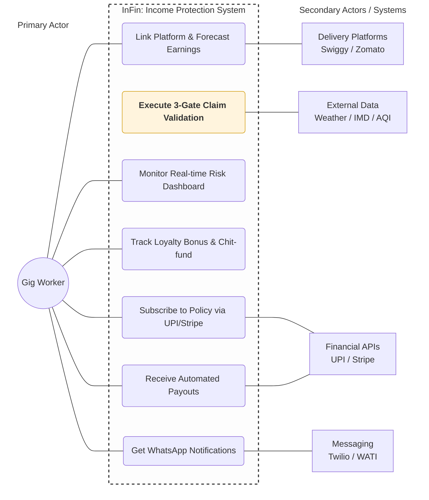

# InFin - Income Protection for India's Gig Workers

## Abstract
InFin uses real-time external data and behavioral analytics to detect disruption events and autonomously process claims without user intervention. The system employs a multi-stage validation pipeline consisting of a Disruption Validity Score (DVS), Zone Peer Comparison Score (ZPCS), Activation Eligibility Check (AEC) and Anti-spoofing is done to ensure accurate and fraud-resistant claim verification. Personalized premiums are dynamically computed using machine learning models based on user earnings and regional risk. To improve trust and affordability, InFin introduces a hybrid insurance + chit-fund model (If the user continuously pays for 6 months and never got refunded then in order to build trust we refund large portion of their payings), where consistent users can recover a significant portion of their premiums if no claims are made. By combining automated event detection, data-driven validation, and instant UPI payouts, InFin delivers a scalable and worker-friendly alternative to traditional insurance.

---

## Table of Contents

- [Overview](#overview)
- [Problem](#problem)
- [How It Works](#how-it-works)
  - [Engine 1 — Policy Pay](#engine-1--policy-pay)
  - [Engine 2 — Policy Claim](#engine-2--policy-claim)
- [3-Gate Claim Validation](#3-gate-claim-validation)
- [Smart Payout Logic](#smart-payout-logic)
- [Anti-Gaming Rules](#anti-gaming-rules)
- [Loyalty Bonus — Chit Fund Model](#loyalty-bonus--chit-fund-model)
- [End-to-End Claim Flow](#end-to-end-claim-flow)
- [Database Schema](#database-schema)
- [Tech Stack](#tech-stack)
- [Product Screens](#product-screens)
- [Getting Started](#getting-started)
- [Anti-Spoofing & Fraud Detection Architecture](#Anti-Spoofing-&-Fraud-Detection-Architecture)

---


## Problem

| Pain Point | Reality |
|---|---|
| **Who it's for** | Swiggy / Zomato delivery partners in Indian cities |
| **Daily earnings** | ₹700 – ₹1,100/day |
| **Risk** | Income drops to zero during floods, bandhs, heatwaves and riots |
| **Why existing insurance fails** | Expensive, tiered, one-size-fits-all, requires paperwork the worker can't afford to do |

---

## How It Works

## Engine 1:- Policy Pay - Expected Earnings Forecast (ML-Based)

Each worker's weekly premium is computed individually from their verified platform earnings and their zone's historical disruption rate. Instead of using a simple average, we predict each worker’s expected daily earnings using a time-series forecasting model.

Gig worker income is highly variable:
- Weekends have higher demand
- Weather disruptions reduce earnings
- Seasonal patterns affect delivery volume
Therefore, using a static average would lead to inaccurate pricing and payouts.

### Model Approach
We use a time-series model (Exponential Smoothing) trained on:

- Last 4 weeks of earnings history
- Day-of-week patterns (weekday vs weekend)
- Delivery volume trends
- Seasonal effects (monsoon, festivals)

**Output**: expected_daily_earnings = ML predicted value for next day

**Data Window**: We use a rolling 4-week window as it provides the best balance between recency (captures current behavior) & stability (reduces noise)

## Data Pipeline

1. Earnings data is collected per worker and stored in `earnings_history`
2. A weekly job trains the forecasting model per worker
3. Engine 1 uses this predicted value to compute weekly premium

```
weekly_premium = ROUND(
  expected_daily_earnings
  × disruption_probability
  × conflict_ratio
  × 1.15 / 0.65
)
```
```
conflict_ratio = (workers paid in past 4 weeks) / (workers who claimed) 
```

### Example
— Rajan, Chennai
- Daily earnings: ₹872
- Disruption probability: 0.0615
- Conflict ratio: 0.70

```
= ROUND(872 × 0.0615 × 0.70 × 1.15 / 0.65)
= ₹58 / week
```

---

## Engine 2:- Policy Claim - 4-Gate Claim Validation

### Gate 1 — Disruption Validity Score (DVS)

*Question: Did a real external disruption actually occur?*

This gate evaluates only **external data sources** (weather APIs, AQI APIs, IMD alerts).  
No worker data is considered at this stage.


### DVS Formula

DVS is computed as a weighted combination of:

DVS = (source_agreement_score × 0.60)  
   + (threshold_breach_score × 0.40)

### Source Agreement Score (60%)

Measures how many independent data sources confirm the disruption.

| Sources Confirming | Score |
|------------------|------|
| Both sources confirm | 1.00 |
| Only one source confirms | 0.50 |
| Neither confirms | 0.00 |
| Single-source trigger (e.g., AQI via CPCB) | 1.00 if API confirms |

 Rationale: Multiple independent confirmations increase confidence that the event is real.


### Threshold Breach Score (40%)

Measures how strongly the observed value exceeds the predefined threshold.

Each disruption type has a threshold stored in the system:

- Rain ≥ 35 mm → disruption
- AQI ≥ 300 → hazardous
- Heat Index ≥ 42°C → extreme

### Formula
```
threshold_breach_score =  
min(1.00, ((actual_value − threshold_value) / threshold_value) × 2)
```

### Example Calculations

| Trigger | Threshold | Actual | Breach Score | Interpretation |
|--------|----------|--------|--------------|---------------|
| Rainfall | 35 mm | 37 mm | 0.114 | Borderline |
| Rainfall | 35 mm | 52 mm | 0.971 | Strong disruption |
| Rainfall | 35 mm | 80 mm | 1.00 | Extreme event |

 Small breaches → low confidence  
 Large breaches → high confidence  


### Final Decision

**Pass condition:**

DVS ≥ 0.70 → Valid disruption  
DVS < 0.70 → Rejected (event considered weak or unconfirmed)

---

### Gate 2 — Zone Peer Comparison Score (ZPCS)

Compares the claimant's delivery activity against all peers in the same pincode during the same window. If the disruption was real, most workers in the zone will show reduced activity.

**Pass condition:** ≥ 35% of zone peers are affected (≥ 40% drop in their deliveries)

---

### Gate 3 — Activation Eligibility Check (AEC)

A hard boolean check covering:
- Was the policy bought **before** the event was publicly announced?
- Is the worker outside the 6-hour refractory window for spontaneous events?
- Is the event outside the 72-hour known-event exclusion window?

**Pass condition:** AEC = TRUE

---

No action required from the worker. The system runs daily and checks for disruptions automatically.

```
Gate 1 → DVS ≥ 0.70   (Was the disruption real?)
Gate 2 → ZPCS ≥ 0.35  (Was it zone-wide?)
Gate 3 → AEC = TRUE   (Was the event covered?)

All 3 pass → payout formula runs → UPI transfer
```

Payout is triggered and released only once the disruption parameter that caused Gate 1 to pass returns to normal (back below threshold) and the insurance ends.

---

### Gate 4 — Anti-Spoofing & Fraud Detection (WAS)
### Problem & Approach

GPS spoofing is a major challenge in disruption-based insurance systems, where users may fake their location to appear inside a high-risk zone and trigger payouts.

To address this, InFin moves beyond rule-based validation and introduces a machine learning–driven scoring system called the Worker Authenticity Score (WAS).

Instead of relying on a single signal like GPS, WAS models each worker as a time-series of behavioral signals and performs anomaly detection across multiple independent dimensions. This makes the system robust against manipulation, as real-world behavior is significantly harder to fake than location data.

### Worker Authenticity Score (WAS)

WAS is computed as a weighted combination of multiple behavioral signals:
```
WAS = f(mobility_pattern, peer_consistency, network_behavior, platform_activity)
```

Each component is modeled using statistical learning and anomaly detection techniques. Even if one signal is spoofed, the overall system remains reliable.

### Core Detection Layers (ML-Based)

#### Mobility Pattern Analysis

- Processes continuous GPS trajectories as sequential data
- Evaluates:
  - Speed consistency
  - Route alignment
  - Trajectory continuity
- Detects impossible movements such as teleportation or synthetic paths

#### Peer Consistency Modeling

- Compares worker behavior with others in the same zone
- Uses clustering and similarity scoring
- Detects coordinated fraud patterns across multiple accounts

#### Network Behavior Modeling

- Models cell tower transitions and signal variance
- Real-world networks show noisy, irregular patterns
- Flags artificially stable signals typical of spoofed environments

#### Platform Activity Modeling

- Builds baseline profiles using historical delivery data
- Tracks:
  - Order acceptance rates
  - Completion times
  - Activity density
- Detects unnatural inactivity during disruptions

### Model Ensemble & Weighting

The final WAS is computed using a weighted ensemble:

- Mobility Pattern → 35%
- Peer Consistency → 25%
- Network Behavior → 20%
- Platform Activity → 20%

This ensures balanced decision-making across independent behavioral signals.

### Decision System

Instead of binary approval, WAS feeds into a three-stage decision engine:

🟢 **Approved**
- High authenticity score
- Instant payout

🟡 **Flagged**
- Suspicious but not conclusive
- Payout delayed (not denied)
- Re-evaluated with additional data

🔴 **Blocked**
- Strong anomaly signals
- Claim sent for audit and further verification

### Continuous Learning

The WAS model continuously improves over time by learning from new behavioral data and fraud patterns. This allows the system to adapt to evolving spoofing techniques while maintaining fairness for genuine workers.

#### Why This Works

Fraudsters may spoof GPS location, but cannot easily replicate:

- Real movement trajectories
- Noisy network behavior
- Consistent delivery patterns
- Peer-aligned activity

By combining these signals, InFin ensures strong fraud resistance without penalizing genuine users.

## Smart Payout Logic

Payout is not all-or-nothing. It compensates for what the worker **would have earned** during the disruption minus what they **actually earned**, while ensuring a minimum income floor.

---

### Core Logic

- **Expected Earnings (E)** = average of previous earnings  
- **Disruption Duration (D)** = hours of disruption  
- **Total Working Hours (T)** = Workers working window 


disrupted_expected = (D / T) × E
floor = 0.5 × disrupted_expected


---

### Payout Rules

| Scenario | Payout |
|---|---|
| Worker didn't work | `floor` |
| Worked but earned below floor | `(floor − actual_earned) + (0.1 × floor)` |
| Worked and earned above floor | ₹0 (already protected) |

---

### Example

- Expected (E) = ₹800  
- Disruption = 6 hours  
- Total working hours = 8  


disrupted_expected = (6 / 8) × 800 = ₹600
floor = 0.5 × 600 = ₹300


---

**Worker stays home:**

Payout = ₹300
Total income = ₹300


---

**Worker earns ₹100:**

Payout = (300 − 100) + (0.1 × 300)
= 200 + 30
= ₹230

Total income = 100 + 230 = ₹330


---

### Key Outcome

- Worker at home → ₹300  
- Worker who tries → ₹330  

Effort is rewarded  
Core payout logic remains unchanged  
Simple additive incentive  

---

---

## Anti-Gaming Rules

| Event Type | Exclusion Rule |
|---|---|
| **Bandh / Strike** | Policy bought after public announcement of the bandh date is excluded for that event |
| **Cyclone** | Policy bought after IMD orange alert issuance is excluded for that cyclone |
| **Flood** | ML model predicts affected zones and days; policies bought after flood risk is confirmed are excluded for those specific dates and pincodes |
| **Spontaneous events** (riots, road closures, Section 144) | 6-hour refractory period — must be a policyholder at least 6 hours before the event started |
| **Known-event window** | If the disruption was already in the alert snapshot at subscription time and current time is within 72 hours of subscription, the claim is excluded |

---

## Loyalty Bonus — Chit Fund Model

Workers who pay continuously for 24 weeks (6 months) never truly "lose" their premiums.

| Scenario | Premium Return |
|---|---|
| No claims filed during full term | **80–90%** returned |
| Claims made during term | **10–20%** returned, scaled by claim frequency |

**Loyalty counter reset rules:**
- If a worker misses a weekly payment OR claims a payout during the term, the cumulative premium sum and transaction count reset to zero.
- Only an unbroken 24-week streak qualifies for the end-of-term settlement.
- A static 48 hr is given as a relaxation period after the insurance policy ends.

Settlement is triggered automatically upon plan completion and paid via UPI.

---

## End-to-End Claim Flow

```
External API detects disruption
        ↓
Gate 1: DVS computed
        ↓ (pass)
Gate 2: ZPCS computed
        ↓ (pass)
Gate 3: AEC verified
        ↓ (pass)
Disruption parameter returns to normal
        ↓
Payout calculated
        ↓
UPI transfer to worker
        ↓
WhatsApp notification sent
```

All steps are fully automated. Workers are notified via WhatsApp at each stage.

---

## Database Schema

Built on **Supabase (Postgres)**.

### `workers`
| Column | Type | Notes |
|---|---|---|
| `id` | uuid (PK) | |
| `phone` | text | |
| `platform` | text | Swiggy / Zomato |
| `city` | text | |
| `pincode` | text | Zone key |
| `expected_daily_earnings` | numeric | Updated per order in real time |
| `disruption_probability` | numeric | Updated per disrupted day over rolling 1-year window |

### `policies`
| Column | Type | Notes |
|---|---|---|
| `id` | uuid (PK) | |
| `worker_id` | uuid (FK → workers) | |
| `weekly_premium` | numeric | |
| `status` | text | active / expired / cancelled |
| `plan_duration_months` | int | 3 or 6 |
| `subscribed_at` | timestamptz | |
| `next_due_date` | timestamptz | |

### `zone_disruption_events`
| Column | Type | Notes |
|---|---|---|
| `id` | uuid (PK) | |
| `pincode` | text | |
| `event_type` | text | flood / cyclone / bandh / heat / aqi |
| `actual_value` | numeric | |
| `threshold_value` | numeric | |
| `dvs_score` | numeric | |
| `dvs_passed` | boolean | |
| `is_announced` | boolean | |
| `is_spontaneous` | boolean | |

### `peer_activity_snapshots`
| Column | Type | Notes |
|---|---|---|
| `event_id` | uuid (FK) | |
| `worker_id` | uuid (FK) | |
| `deliveries_during_trigger` | int | |
| `avg_deliveries_same_window` | numeric | |
| `activity_reduction` | numeric | % drop |
| `is_affected` | boolean | ≥ 40% drop |

### `claims`
| Column | Type | Notes |
|---|---|---|
| `policy_id` | uuid (FK) | |
| `event_id` | uuid (FK) | |
| `dvs_passed` | boolean | |
| `zpcs_passed` | boolean | |
| `aec_passed` | boolean | |
| `floor_amount` | numeric | |
| `actual_earned` | numeric | |
| `final_payout` | numeric | |
| `weekly_cap_remaining` | numeric | |
| `status` | text | pending / approved / paid |
| `paid_at` | timestamptz | |

### `loyalty_settlements`
| Column | Type | Notes |
|---|---|---|
| `policy_id` | uuid (FK) | |
| `total_premiums_paid` | numeric | |
| `had_claims` | boolean | |
| `return_percentage` | numeric | |
| `return_amount` | numeric | |
| `settled_at` | timestamptz | |

---

## Tech Stack

| Layer | Technology |
|---|---|
| **Frontend** | Next.js (App Router) |
| **Database** | Supabase (Postgres + Auth + Realtime) |
| **Backend logic** | Supabase Edge Functions |
| **UI** | Tailwind CSS + shadcn/ui |
| **Payments** | Stripe (premium collection), UPI (payouts) |
| **Notifications** | WhatsApp via Twilio / WATI |
| **Weather & AQI** | External weather and AQI APIs |
| **Flood prediction** | Custom ML model (zone + date level) |
| **Disaster alerts** | IMD Alert APIs |

---

## Product Screens

### Worker Dashboard
Active policy card, weekly cap remaining, live zone disruption alert banner (Supabase Realtime), and recent claims feed showing gate-by-gate pass/fail results.

### Claim Detail Modal
DVS gauge breakdown, ZPCS peer count visualization, AEC pass/fail with plain-language reason, step-by-step payout math.

### Policy Subscription (3 steps)
1. Phone OTP verification
2. Platform account link + earnings fetch
3. Plan selection (3 or 6 months) with loyalty return preview → UPI payment confirm

### Loyalty Tracker
Progress bar, total premiums paid, live return projection for zero-claim vs claim scenarios, countdown to settlement date.

### Admin / Ops Panel
All disruption events with gate scores, claims pipeline (pending → approved → paid), zone heatmap by pincode, manual override with audit log.

---

## Getting Started

```bash
# Clone the repo
git clone https://github.com/KasiramSayee/Guideware.git
cd infin
```

```bash
# Install dependencies
npm install
```

```bash
# Set up environment variables
cp .env.example .env.local
# Fill in: NEXT_PUBLIC_SUPABASE_URL, SUPABASE_SERVICE_ROLE_KEY,
#          STRIPE_SECRET_KEY, TWILIO_ACCOUNT_SID, TWILIO_AUTH_TOKEN

# Run database migrations
npx supabase db push
```

```bash
# Start development server
npm run dev
```

---




### UI Screenshots


